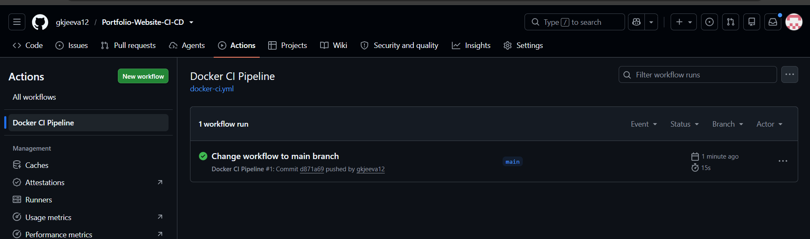
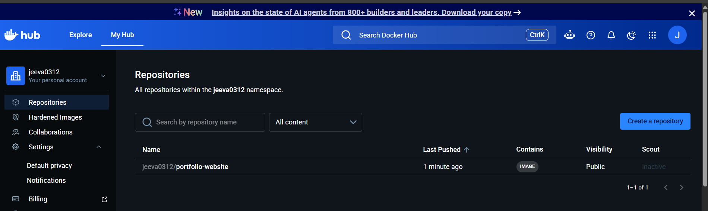
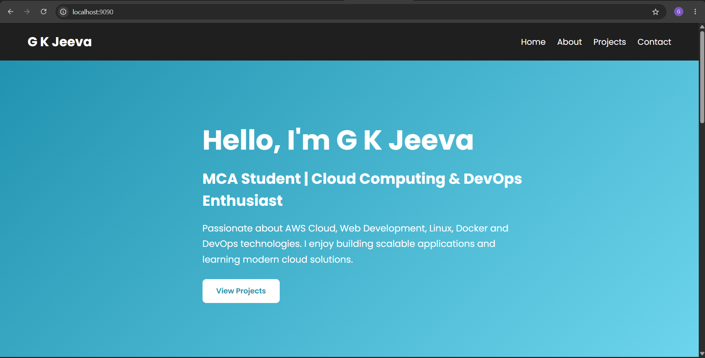

# CI/CD Automation for Dockerized Portfolio Website using GitHub Actions

## 📌 Project Overview

This project demonstrates a complete CI/CD pipeline for a Dockerized Portfolio Website using **GitHub Actions** and **Docker Hub**.

Whenever code is pushed to the GitHub repository, GitHub Actions automatically:

- ✅ Builds the Docker image
- ✅ Authenticates with Docker Hub
- ✅ Pushes the latest Docker image to Docker Hub

This eliminates manual deployment steps and provides an automated build pipeline.

---

## 🚀 Technologies Used

- Git
- GitHub
- GitHub Actions
- Docker
- Docker Hub
- HTML
- CSS
- Nginx

---

## 📂 Project Structure

```
Portfolio-Website-CI-CD
│
├── .github
│   └── workflows
│       └── docker-ci.yml
│
├── Screenshots
│   ├── workflow-success.png
│   ├── dockerhub-repository.png
│   └── portfolio-website-9090.png
│
├── Dockerfile
├── index.html
├── README.md
```

---

## 🔄 CI/CD Workflow

```
Developer
     │
     ▼
Push Code to GitHub
     │
     ▼
GitHub Actions
     │
     ▼
Build Docker Image
     │
     ▼
Login to Docker Hub
     │
     ▼
Push Docker Image
     │
     ▼
Docker Hub Repository
```

---

## ⚙️ GitHub Actions Workflow

The workflow automatically executes whenever code is pushed to the **main** branch.

Workflow Steps:

- Checkout Repository
- Login to Docker Hub
- Build Docker Image
- Push Docker Image

---

## 🐳 Docker Image

**Docker Hub Username:** `Jeeva0312`

**Image Name:**

```
Jeeva0312/portfolio-website
```

---

## ▶️ Run the Project Locally

### Build Docker Image

```bash
docker build -t portfolio-website .
```

### Run Docker Container

```bash
docker run -d -p 9090:80 portfolio-website
```

Open:

```
http://localhost:9090
```

---

# 📸 Screenshots

## GitHub Actions Workflow



---

## Docker Hub Repository



---

## Portfolio Website



---

## 👨‍💻 Author

**Jeeva**

- GitHub: https://github.com/gkjeeva12
- Docker Hub: https://hub.docker.com/u/Jeeva0312
